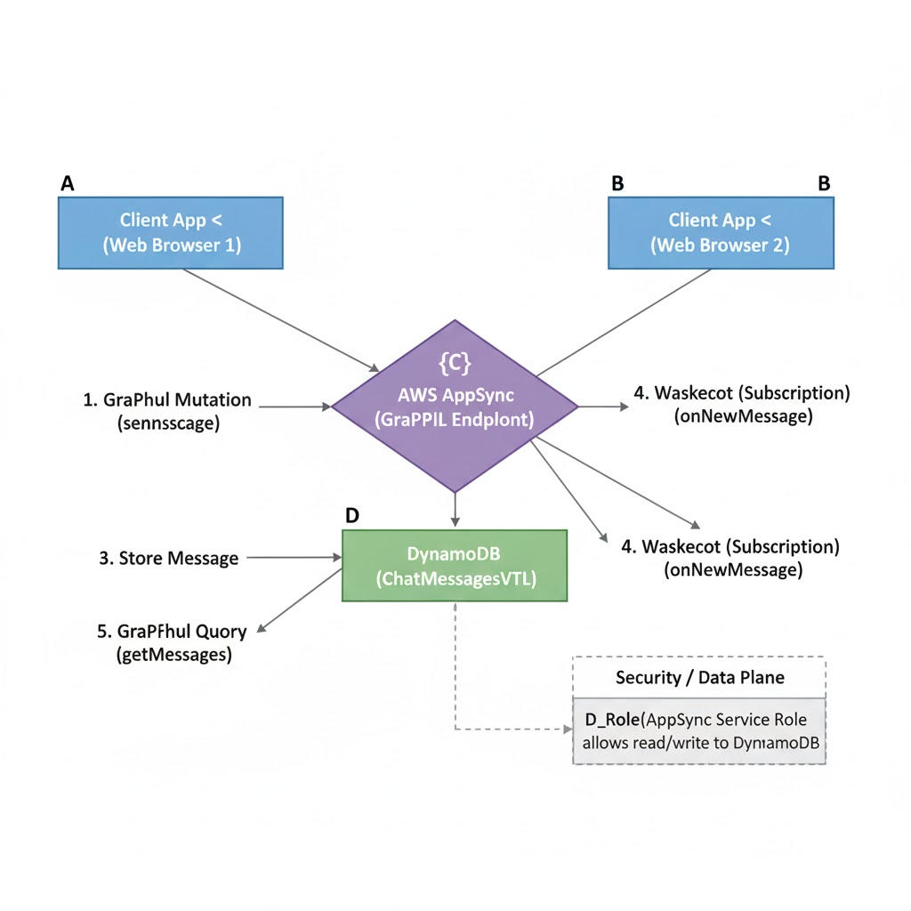
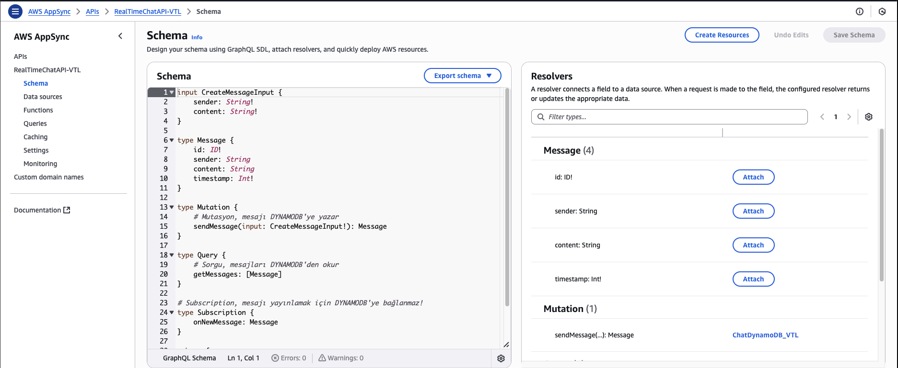
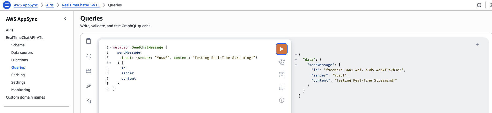

## Real-Time Chat App Backend (AppSync+DynamoDB)

This project delivers a high-performance, serverless backend for a real-time chat application. It utilizes AWS AppSync and GraphQL Subscriptions to enable instant messaging capabilities across multiple clients, showcasing expertise in modern, event-driven data management.

## Architecture and Data Flow

The core architecture relies on AWS AppSync to handle all GraphQL queries and real-time connections, seamlessly bridging the application logic with the NoSQL data layer.

    AppSync (GraphQL Endpoint): Manages all API requests (Query, Mutation, Subscription) and maintains WebSocket connections for real-time updates.

    DynamoDB (ChatMessagesVTL Table): Stores message history, optimized with a Compound Key (id - String, timestamp - Number) for efficient writes and ordered retrieval.

    VTL Resolvers: Serve as the secure mapping layer, transforming GraphQL calls into DynamoDB operations.

Architecture Diagram:

## Key Technical Achievements

This project proves expertise in building complex, modern backends:

    GraphQL and Real-Time Subscriptions: Successfully defined and implemented a GraphQL schema enabling Query, Mutation, and Subscription operations—the foundation for any real-time application.

    VTL Resolver Mastery: Utilized Velocity Template Language (VTL) resolvers to solve complex data mapping challenges, specifically ensuring automatic generation and correct DynamoDB tiplendirmesi for the Partition Key (id - String) and Sort Key (timestamp - Number) during the sendMessage mutation.

    Secure Data Operations: Established a PutItem operation that reliably writes new messages to DynamoDB, verifying the integrity of the data layer integration.

## Visual Documentation Checklist

    Schema Definition:

    Working Proof (Mutation):

